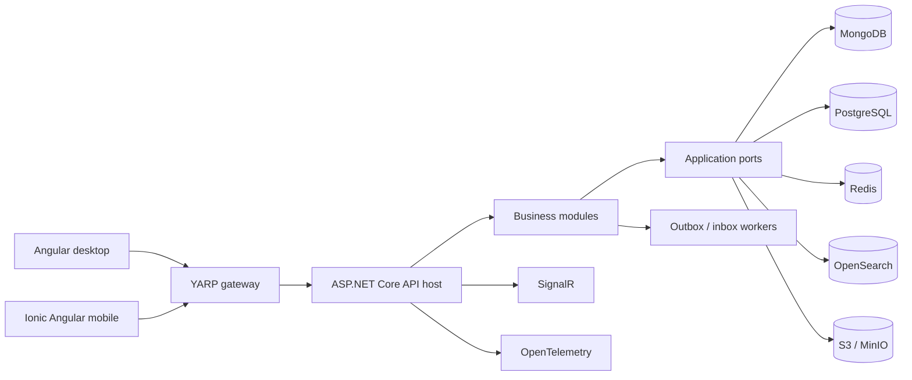

# Zumbo Enterprise Work Management

Zumbo is an enterprise work-management platform for coordinating projects, teams, tasks, workflows, planning, automation and reporting. It combines a modular .NET backend with dedicated Angular desktop and Ionic Angular mobile applications, provider-portable persistence, durable background processing and containerized local infrastructure.

The repository contains the complete product: application source, API contracts, database providers, operational tooling, automated tests and continuous-integration workflows.

## Key capabilities

- Project, team and organization lifecycle management
- Kanban boards with ranked cards, configurable columns, swimlanes and saved views
- Backlog, sprint, roadmap, timeline, calendar and workload planning
- Work-item details, comments, labels, checklists, work logs, attachments and approvals
- Configurable workflows, statuses, transitions and project-level authorization
- Personal work, inbox, notifications and realtime collaboration
- Intake forms, automation rules, recurring work and background job tracking
- Goals, portfolios, initiatives and capacity planning
- Dashboards, reports, audit history and privacy operations
- Knowledge documents and development/webhook integrations
- Responsive desktop and mobile experiences with offline-aware PWA support

## Architecture

Zumbo is implemented as a modular monolith. Business modules own their domain and application behavior, while explicit contracts and ports isolate presentation, persistence and infrastructure concerns. Feature-oriented command/query slices keep use cases reviewable without coupling them to a database or HTTP adapter.



The API host composes modules and controller-based `/api/**` presentation. SignalR hubs, health endpoints and gateway behavior remain framework-specific adapters. Architecture tests enforce project references and module boundaries.

## Technology stack

| Area | Technologies |
| --- | --- |
| Backend | .NET 8, ASP.NET Core 8.0.28, controller-based APIs, SignalR |
| Gateway | YARP 2.3.0 |
| Desktop | Angular 22.0.8, Angular CLI 22.0.9, Bulma 1.0.2 |
| Mobile | Angular 22.0.8, Ionic Angular 8.8.15 |
| Persistence | MongoDB Driver 2.30.0, PostgreSQL/Npgsql 8.0.9 |
| Distributed services | Redis, OpenSearch, S3-compatible object storage |
| Observability | OpenTelemetry 1.17.0, Prometheus and Grafana configurations |
| Testing | xUnit 2.9.3, ASP.NET Core test host, Node test runner, Playwright Core 1.61.1 |
| Tooling | pnpm 9.0.0, TypeScript 6.0.2, Docker Compose |

Versions above are pinned in [`Directory.Packages.props`](Zumbo/Backend/Directory.Packages.props) and [`package.json`](Zumbo/Frontend/package.json).

## Repository map

```text
.
|-- .github/                 CI workflows and repository policy
|-- Zumbo/
|   |-- Backend/             .NET solution, modules, providers and tests
|   |-- Frontend/            Angular CLI desktop/mobile workspace and tests
|   |-- contracts/           Versioned OpenAPI compatibility baseline
|   |-- docs/                Architecture, quality and operations guidance
|   `-- scripts/             Local operations, CI and product utilities
`-- README.md                Project overview and navigation
```

## Backend modules

| Module | Responsibility |
| --- | --- |
| Identity | Authentication, sessions, MFA, account security and authorization |
| Organizations | Tenant and organization lifecycle |
| Teams | Team membership and collaboration boundaries |
| Projects | Project lifecycle, members, resources and policy contracts |
| Boards | Board structure, columns, views, ordering and swimlanes |
| Workflows | Configurable statuses, transitions and workflow policies |
| WorkItems | Tasks, planning, collaboration, automation, strategy and integrations |
| Notifications | Preferences, notification creation and delivery |
| Audit | Auditable activity and integrity queries |

See the [backend guide](Zumbo/Backend/README.md) for entry points, contracts and persistence ownership.

## Frontend applications

The Angular CLI workspace contains:

- `modern-desktop`: a dense responsive work-management application using Bulma and the shared design system;
- `modern-mobile`: an Ionic Angular application adapted for mobile navigation and touch workflows;
- `modern-shared`: API, authentication, routing, state and domain UI shared by both clients.

Both applications build as production PWAs. The frontend test suite covers components, API contracts, accessibility, responsive behavior and real-browser product flows. See the [frontend guide](Zumbo/Frontend/README.md).

## Data and infrastructure

MongoDB is the default document provider. PostgreSQL implements the same repository contracts and includes ordered migrations, rollback checks and transfer tooling. Redis supports distributed coordination and SignalR scaling; OpenSearch provides indexed search; MinIO supplies the local S3-compatible object store.

The canonical Compose topology starts MongoDB, replica-set initialization, OpenSearch, Redis, MinIO, API, worker and gateway services. Additional Compose overlays cover PostgreSQL tests, observability, hardened and production-like configurations.

## Security

Zumbo uses JWT authentication, refresh-session controls, MFA, CSRF protection where browser credentials require it, organization/project authorization and a data-backed permission catalog. Security validation includes secret scanning, dependency policy, container scanning, authorization tests and optional CodeQL jobs when GitHub Code Security is available.

Read [security architecture](Zumbo/docs/security/authorization.md) and [security validation](Zumbo/docs/quality/security-validation.md) before changing authentication, authorization or externally reachable adapters.

## Testing

The repository includes:

- unit and domain tests;
- API and gateway contract tests;
- architecture boundary tests;
- MongoDB, PostgreSQL and object-storage integration tests;
- frontend unit and production-build checks;
- browser accessibility and end-to-end scenarios;
- migration, OpenAPI and security gates.

See [testing and quality gates](Zumbo/docs/quality/testing.md) for focused and full commands.

## CI and quality gates

GitHub Actions validates backend builds and tests, provider contracts, frontend quality, runtime browser behavior, dependency policy, container security and conditional CodeQL analysis. Generated reports, browser captures and scan output are uploaded as workflow artifacts rather than stored in Git history.

## Quick start

Prerequisites: Docker Desktop with Compose, a .NET SDK capable of targeting .NET 8, Node 20.9 or later in the Node 20 line, and pnpm 9.0.0.

```powershell
cd Zumbo
corepack enable
corepack prepare pnpm@9.0.0 --activate
pnpm --dir Frontend install --frozen-lockfile
node scripts/operations/prepare-env.mjs --output Backend/.env
node scripts/operations/preflight.mjs --environment Backend/.env
node scripts/operations/demo-start.mjs --environment Backend/.env --build
```

Open `http://127.0.0.1:58177`. The gateway is available at `http://127.0.0.1:58089`; direct API access is bound to `http://127.0.0.1:58088`.

Stop the local topology without deleting persistent volumes:

```powershell
node scripts/operations/demo-stop.mjs --environment Backend/.env
```

The environment generator refuses to overwrite an existing `.env` file and creates local random secrets. For bootstrap and populated local data, follow the [local operations runbook](Zumbo/docs/operations/local-development.md).

## Documentation index

- [Application guide](Zumbo/README.md)
- [Backend guide](Zumbo/Backend/README.md)
- [Frontend guide](Zumbo/Frontend/README.md)
- [Architecture overview](Zumbo/docs/architecture/overview.md)
- [Module boundaries](Zumbo/docs/architecture/modules.md)
- [Data and messaging](Zumbo/docs/architecture/data-and-messaging.md)
- [Security and authorization](Zumbo/docs/security/authorization.md)
- [Testing and quality gates](Zumbo/docs/quality/testing.md)
- [Local development](Zumbo/docs/operations/local-development.md)
- [Database operations](Zumbo/docs/operations/database-migrations.md)
- [Scripts reference](Zumbo/scripts/README.md)
- [Contracts reference](Zumbo/contracts/README.md)

## Useful commands

Run from `Zumbo/` unless noted otherwise.

```powershell
dotnet restore Backend/Zumbo.sln
dotnet build Backend/Zumbo.sln --configuration Release --no-restore
dotnet test Backend/Zumbo.sln --configuration Release --no-build
pnpm --dir Frontend run lint
pnpm --dir Frontend run unit
pnpm --dir Frontend run build
docker compose --env-file Backend/.env -f Backend/docker-compose.yml config --quiet
```
