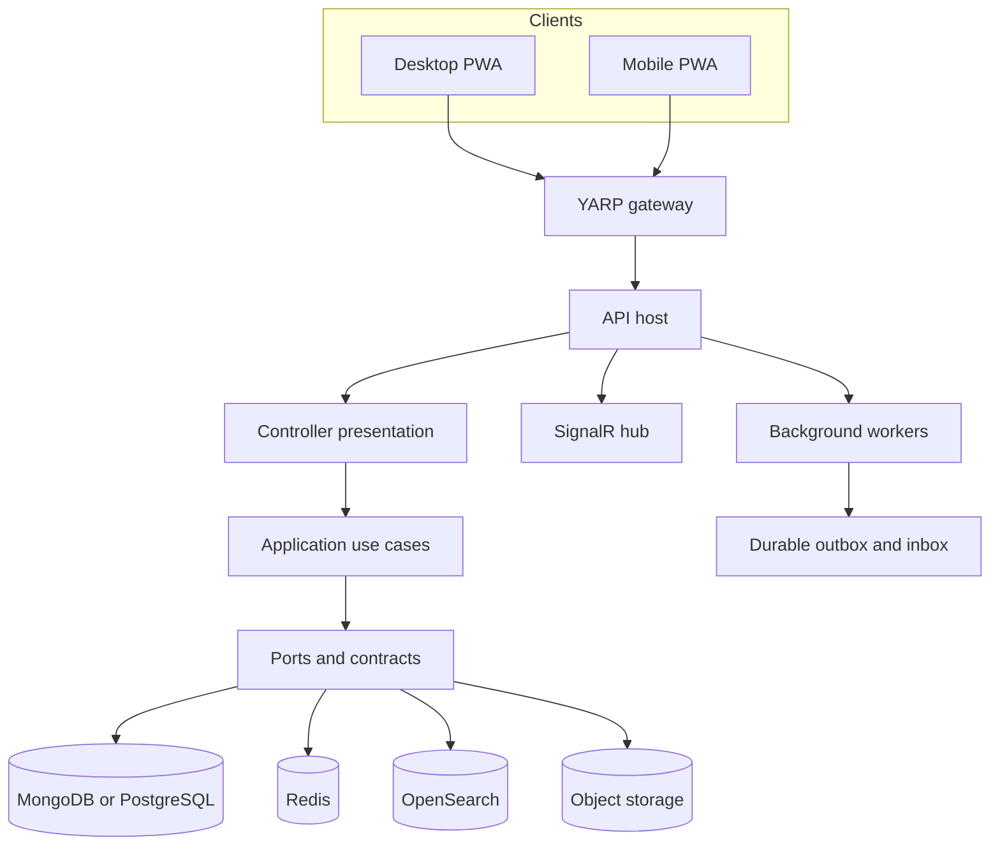

# Architecture Overview

Zumbo is a .NET 8 modular monolith with separate Angular desktop and Ionic Angular mobile clients. The deployment unit is intentionally cohesive, while source projects and tests enforce ownership boundaries that allow individual capabilities to evolve independently.

## Runtime topology

`Zumbo.Api` is the composition root. [`Program.cs`](../../Backend/src/Zumbo.Api/Program.cs) registers modules, while `Composition/Hosting` owns middleware, security, storage and endpoint wiring. Business HTTP routes use small controller classes under `Presentation/Controllers`. Health checks and the work-item SignalR hub remain dedicated framework endpoints.

## Boundary model

- **Domain and application:** module-owned aggregates, policies, commands and queries.
- **Ports:** interfaces and contract projects required by application behavior.
- **Adapters:** MongoDB, PostgreSQL, Redis, OpenSearch, S3-compatible storage, email and webhook implementations.
- **Presentation:** controllers translate HTTP semantics into application use cases.
- **Composition:** the API host selects adapters and registers module entry points.

Dependencies point inward. Business modules do not depend on controller types or a concrete storage engine. Architecture tests validate project references, module-first source layout and frontend security constraints.

## Cross-cutting behavior

The shared kernel contains stable primitives. Building-block projects provide application and infrastructure capabilities such as document repositories, transactions, durable messaging, storage, caching and resilience. Correlation, exception mapping, rate limiting, authentication and telemetry are composed at the host boundary.

## Evolution model

New behavior should normally enter through a module-owned use case and an existing port. Add a new abstraction only when application behavior needs to remain independent from an external implementation. Cross-module data sharing should use explicit contracts rather than direct access to another module's persistence documents.
